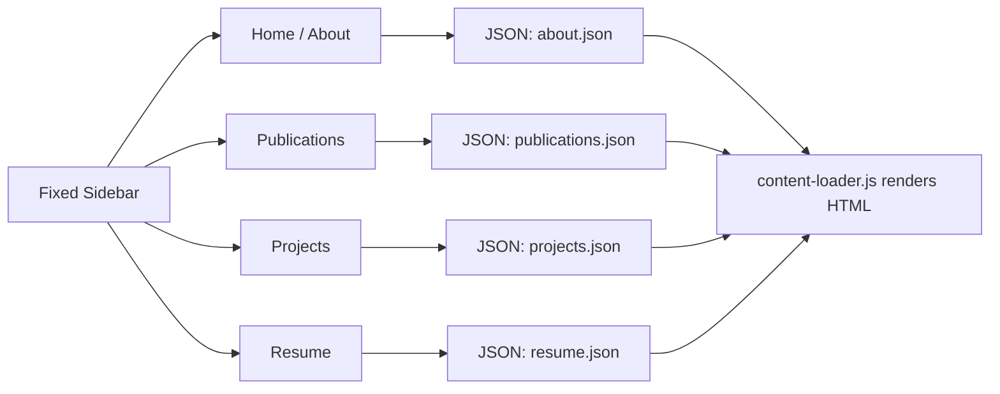
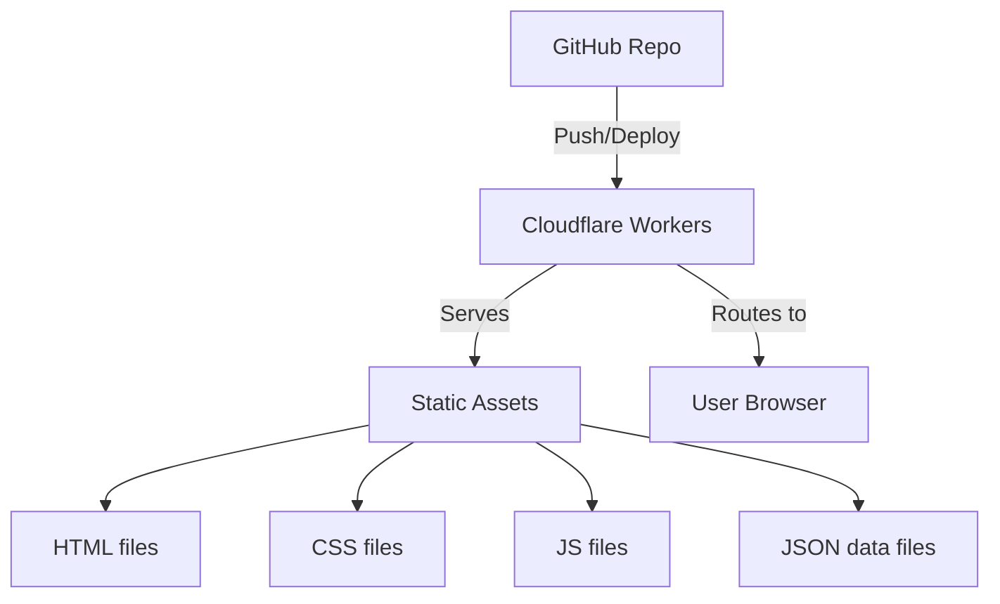

# Personal Research Portfolio — Technical Plan

## 1. Overview

A minimal, academic-style personal portfolio website built with **plain HTML, CSS, and vanilla JavaScript**. Content is stored in **JSON files** for easy editing. The site is deployed via **Cloudflare Workers** connected to a **GitHub repository**.

---

## 2. Site Architecture

```
site/
├── index.html          # Home / About page
├── publications.html   # Publications list
├── projects.html       # Projects list
├── resume.html         # Resume / CV page
├── css/
│   └── style.css       # Global styles
├── js/
│   ├── navigation.js   # SPA-like section switching
│   └── content-loader.js  # Fetches and renders JSON data
├── data/
│   ├── about.json      # Bio, photo, social links
│   ├── publications.json  # List of publications
│   ├── projects.json       # List of projects
│   └── resume.json         # Education, experience
└── assets/
    └── images/         # Profile photo, project screenshots
```

---

## 3. Navigation Design

The site uses a **single-page application (SPA) approach** with a fixed sidebar navigation. Clicking nav items loads content dynamically without full page reloads.



### Navigation Features
- **Fixed left sidebar** with links to all sections
- **Active state highlighting** for current section
- **Smooth transitions** between sections
- **Responsive design** — sidebar collapses to a hamburger menu on mobile

---

## 4. Page Designs

### 4.1 Home / About Page
- Profile photo (circular)
- Name and title
- Short bio paragraph
- Research interests (tag-style badges)
- Social links (Google Scholar, GitHub, LinkedIn, Twitter)

### 4.2 Publications Page
- Filterable list of publications
- Each entry shows: title, authors, venue, year, links (PDF, code, citation)
- Badges for paper status (e.g., "Accepted", "Under Review")

### 4.3 Projects Page
- Card-based grid layout
- Each card: project name, description, tech stack tags, links (GitHub demo)
- Responsive grid (3 columns on desktop, 1 on mobile)

### 4.4 Resume Page
- Timeline-style layout for education and experience
- Skills section with categorized lists
- Downloadable CV PDF link

---

## 5. JSON Data Schemas

### about.json
```json
{
  "name": "Your Name",
  "title": "PhD Student in Computer Vision",
  "affiliation": "University Name",
  "bio": "Short biography paragraph...",
  "photo": "assets/images/profile.jpg",
  "researchInterests": ["Computer Vision", "Machine Learning", "Multimodal Learning"],
  "socialLinks": {
    "scholar": "https://scholar.google.com/...",
    "github": "https://github.com/...",
    "linkedin": "https://linkedin.com/in/...",
    "twitter": "https://twitter.com/..."
  }
}
```

### publications.json
```json
[
  {
    "title": "Paper Title Here",
    "authors": "Author One, Author Two, Author Three",
    "venue": "CVPR 2025",
    "year": 2025,
    "pdf": "https://arxiv.org/pdf/...",
    "code": "https://github.com/...",
    "citation": "BibTeX string",
    "award": "Oral Presentation"
  }
]
```

### projects.json
```json
[
  {
    "name": "Project Name",
    "description": "Brief description of the project...",
    "image": "assets/images/project1.png",
    "techStack": ["PyTorch", "Python", "React"],
    "github": "https://github.com/...",
    "demo": "https://demo..."
  }
]
```

### resume.json
```json
{
  "education": [
    {
      "degree": "PhD in Computer Science",
      "institution": "University Name",
      "year": "2021 - Present",
      "thesis": "Thesis Title"
    }
  ],
  "experience": [
    {
      "role": "Research Intern",
      "company": "Company Name",
      "period": "Summer 2024",
      "description": "What you did..."
    }
  ],
  "skills": {
    "Programming": ["Python", "JavaScript", "C++"],
    "Frameworks": ["PyTorch", "TensorFlow", "React"],
    "Tools": ["Docker", "Git", "Linux"]
  }
}
```

---

## 6. CSS Design Tokens

| Token | Value | Purpose |
|-------|-------|---------|
| Primary Color | `#2563eb` | Links, active states, accents |
| Text Color | `#1f2937` | Body text |
| Muted Text | `#6b7280` | Secondary text |
| Background | `#ffffff` | Main background |
| Sidebar BG | `#f9fafb` | Sidebar background |
| Border | `#e5e7eb` | Dividers, cards |
| Font Family | `system-ui, -apple-system, sans-serif` | Clean, modern typography |
| Max Width | `900px` | Content area |

---

## 7. Cloudflare Workers Deployment

### 7.1 Architecture


### 7.2 Files Required for Deployment

| File | Purpose |
|------|---------|
| `wrangler.toml` | Cloudflare Workers configuration |
| `worker.js` | Worker script that serves static files |
| `package.json` | Project dependencies (wrangler CLI) |

### 7.3 Worker Logic
The worker intercepts all requests and serves files from the `pages` directory (or root). It sets appropriate content-type headers:
- `.html` → `text/html`
- `.css` → `text/css`
- `.js` → `application/javascript`
- `.json` → `application/json`
- `.jpg/.png` → image MIME types

---

## 8. Build & Deployment Steps

1. **Install Cloudflare Wrangler**: `npm install -g wrangler`
2. **Login to Cloudflare**: `wrangler login`
3. **Create Workers project**: `wrangler init --site portfolio-worker`
4. **Configure wrangler.toml**: Set site bucket and worker entry point
5. **Test locally**: `wrangler dev`
6. **Deploy**: `wrangler deploy`
7. **Connect GitHub repo**: Enable GitHub Actions in wrangler for auto-deploy

---

## 9. Implementation Checklist

- [ ] Create HTML structure for all 4 pages
- [ ] Create CSS with responsive design
- [ ] Create JavaScript for navigation and JSON loading
- [ ] Create JSON data files with template content
- [ ] Create Cloudflare Workers configuration
- [ ] Create worker.js for static file serving
- [ ] Create README with deployment instructions
- [ ] Test locally and verify all pages load
